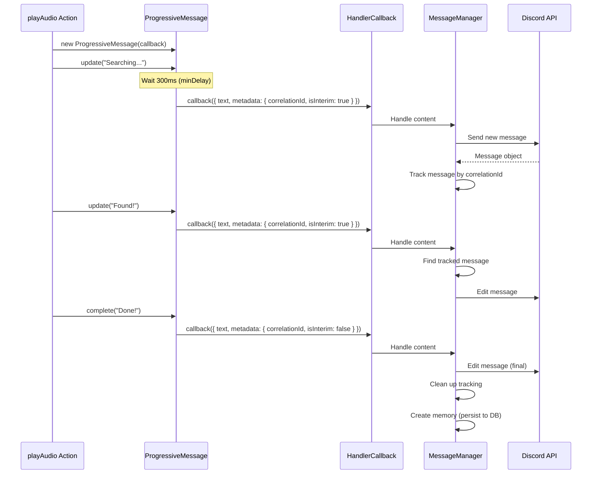

# Progressive Message Updates

## Overview

Progressive message updates provide real-time status feedback for long-running operations by editing a single Discord message as the operation progresses, instead of leaving users staring at silence or sending multiple status messages.

## The Problem

Traditional bot actions leave users in the dark:
```
User: "play bohemian rhapsody"
Bot: ... 10 seconds of silence ...
Bot: "Now playing: Bohemian Rhapsody"
```

Users think the bot is broken during those 10 seconds. They spam commands, ask "are you working?", or leave frustrated.

## The Solution

Progressive updates show what's happening:
```
User: "play bohemian rhapsody"
Bot: "🔍 Looking up track..."         ← Instant feedback
     ↓ (same message, edited)
     "🔍 Searching for track..."      ← 2 seconds later
     ↓ (same message, edited)
     "✨ Setting up playback..."       ← 8 seconds later
     ↓ (same message, edited)
     "🎵 Now playing: Bohemian Rhapsody" ← Final (10 seconds total)
```

## Architecture

### Core Components

1. **ProgressiveMessage** (`progressiveMessage.ts`)
   - Helper class that actions use to send progressive updates
   - Handles debouncing, throttling, and platform detection
   - API: `update()`, `complete()`, `fail()`

2. **MessageManager** (`messages.ts`)
   - Discord message handler with progressive update support
   - Tracks messages by correlation ID with 60-second TTL
   - Edits existing messages when it sees progressive metadata

3. **Message Editing Utility** (`utils.ts`)
   - Wraps Discord.js `message.edit()` with error handling
   - Truncates content > 2000 chars (Discord limit)
   - Returns null on failure for graceful degradation

### Data Flow



## Key Design Decisions

### 1. Why Correlation IDs?

**Problem**: Multiple actions might run simultaneously in the same channel. How do we know which message to edit?

**Solution**: Each `ProgressiveMessage` instance generates a unique correlation ID (`timestamp-random`). All updates from that action include this ID, so MessageManager knows which message to edit.

**Why not use message ID directly?**: The action doesn't know the Discord message ID until after the first update is sent. Correlation ID is generated upfront and stays constant throughout the action.

### 2. Why 60-Second TTL Cleanup?

**Problem**: If an action crashes, throws an exception, or hangs, we'd track its message forever (memory leak).

**Solution**: Each tracked message has a 60-second timeout that auto-deletes it.

**Why 60 seconds?**: Long enough for any legitimate action (most are < 15 seconds), short enough to prevent unbounded growth. The timeout resets with each update, so long-running actions with frequent updates don't expire.

### 3. Why Debouncing (300ms minDelay)?

**Problem**: If an operation completes in < 300ms, showing "Searching..." is just noise.

**Solution**: The first `update()` waits 300ms before sending. If `complete()` is called before that, we skip straight to the final message.

**Example**: 
- Library hit (10ms): User only sees "Now playing!" 
- YouTube search (5s): User sees "Searching..." → "Now playing!"

**Why 300ms specifically?**: Human perception threshold. Operations < 300ms feel instant. Longer feels like waiting.

### 4. Why Throttling (500ms between updates)?

**Problem**: Discord rate limits message edits (5 per 5 seconds per channel). Rapid updates trigger rate limits.

**Solution**: Enforce 500ms minimum between updates. If `update()` is called multiple times rapidly, we debounce and send the last value.

**Why 500ms?**: Allows ~2 edits/second (10 per 5 seconds), well under Discord's 5/5s limit, while still feeling responsive.

### 5. Why "Important" Flag for Non-Editing Platforms?

**Problem**: Web/CLI can't edit messages. Each update creates a new message. Showing all updates floods the UI:
```
Bot: Looking up track...
Bot: Searching for track...
Bot: Found! Setting up...
Bot: Now playing!
```

**Solution**: Non-editing platforms skip transient updates unless marked `important: true`.

**Example**:
```typescript
progress.update("Looking up...");                         // Skipped on web/CLI (fast)
progress.update("Searching...", { important: true });     // Shown (slow)
progress.update("Setting up...");                         // Skipped on web/CLI (fast)
progress.complete("Done!");                               // Always shown
```

**Result on web/CLI**:
```
Bot: Searching for track...
Bot: Now playing!
```

**Why not skip all non-editing updates?**: Some operations genuinely take 5-10+ seconds (searching, fetching external data). Without any feedback, users think the bot is broken. The important flag marks these cases.

### 6. Why No "isFinal" Flag?

**Original design**: 
```typescript
progress.update("Searching...", { isFinal: false });
progress.complete("Done!", { isFinal: true });
```

**Problem**: If an exception occurs before `complete()`, we never send `isFinal: true`, leaving an orphaned "Searching..." message as the final message in chat.

**Current design**: The last message naturally becomes final. If an action throws, the last `update()` stays. The `fail()` method explicitly handles errors.

**Why this is better**: No orphaned messages. TTL cleanup handles crashes. Simpler API (no flag to forget).

### 7. Why isInterim Flag Instead of isFinal?

**Reason**: Determines whether to create a memory (persist to DB).

- `isInterim: true` → Transient status, don't save
- `isInterim: false` → Final message, create memory

**Why not save all updates?**: Database bloat. Saving "Searching...", "Found!", "Setting up...", "Done!" creates 4 memories for one action. Only the final state matters for conversation history.

### 8. Why Metadata Convention Instead of Core Changes?

**Constraint**: "We shouldn't touch core atm" (project requirement)

**Solution**: Use `Content.metadata` to pass progressive update info. Core is unaware; only Discord plugin knows about it.

**Benefits**:
- Zero core changes
- Other plugins (Telegram, etc.) can adopt the same pattern
- Easy to add/remove without breaking anything
- Purely additive feature

## Usage Guide

### Basic Pattern

```typescript
import { ProgressiveMessage } from '@elizaos/plugin-discord';

handler: async (runtime, message, state, options, callback) => {
  const progress = new ProgressiveMessage(callback, message.content.source);
  
  try {
    // Transient updates (skipped on non-editing platforms)
    progress.update("🔍 Starting...");
    
    // ... do fast work (< 1s) ...
    
    // Important update (shown on all platforms)
    progress.update("⏳ This might take a while...", { important: true });
    
    // ... do slow work (5-10s) ...
    
    // Final message (always shown)
    return await progress.complete("✅ All done!");
    
  } catch (error) {
    // Error handling (always shown)
    return await progress.fail("❌ Something went wrong");
  }
}
```

### Guidelines

**DO**:
- ✅ Use for operations that take > 2 seconds
- ✅ Mark important updates that take > 5 seconds
- ✅ Keep updates short and clear
- ✅ Always call `complete()` or `fail()`
- ✅ Use try/catch with `fail()` for errors

**DON'T**:
- ❌ Use for instant operations (< 500ms)
- ❌ Send updates more than every 500ms
- ❌ Mark every update as important
- ❌ Forget to call `complete()` or `fail()`
- ❌ Send very long update text (keep < 200 chars)

### Update Frequency Examples

```typescript
// Good: 2-3 major milestones
progress.update("Searching...");          // 0s
// ... 5 seconds of work ...
progress.update("Found! Preparing...");   // 5s
// ... 3 seconds of work ...
progress.complete("Done!");               // 8s

// Bad: Too many updates
progress.update("Starting...");           // 0s
progress.update("Checking cache...");     // 0.1s
progress.update("Cache miss...");         // 0.2s
progress.update("Fetching...");           // 0.5s
progress.update("Parsing...");            // 1s
progress.update("Validating...");         // 1.5s
// Spammy! Hard to read, triggers throttling
```

## Platform Behavior Matrix

| Platform | Edits? | Shows Transient | Shows Important | Shows Final |
|----------|--------|----------------|----------------|-------------|
| Discord  | ✅ Yes  | ✅ Yes          | ✅ Yes          | ✅ Yes       |
| Web/CLI  | ❌ No   | ❌ No           | ✅ Yes          | ✅ Yes       |
| Future*  | 🤔 TBD  | 🤔 TBD          | ✅ Yes          | ✅ Yes       |

*Future platforms (Telegram, Slack, etc.) can opt into progressive updates by returning true from `supportsProgressive()`

## Error Handling & Edge Cases

### 1. Edit Fails (Message Deleted)

If Discord edit fails (message deleted, permissions changed), we fall back to sending a new message:

```typescript
const edited = await editMessageContent(existing.message, content.text);
if (!edited) {
  // Edit failed - send new message instead
  logger.warn('Failed to edit, falling back to new message');
  await sendMessageInChunks(channel, content.text, ...);
}
```

### 2. Action Crashes

TTL cleanup ensures no memory leaks. After 60 seconds, the tracked message is deleted:

```typescript
setTimeout(() => {
  this.progressiveMessages.delete(key);
}, 60000);
```

### 3. Multiple Actions in Same Channel

Each action has a unique correlation ID, so they don't interfere:

```typescript
// User 1: "play song A"  → correlationId: 1234567890-abc123
// User 2: "play song B"  → correlationId: 1234567891-def456
// Both work independently, editing their own messages
```

### 4. Rate Limiting

500ms throttle ensures we stay under Discord's 5/5s limit. If we exceed it, Discord returns an error, and we fall back to new messages.

## Testing

Unit tests verify core behavior without Discord:

```typescript
// Test fast operations skip interim updates
const progress = new ProgressiveMessage(mockCallback, 'discord');
progress.update('Checking...');
await progress.complete('Done!');
// Only 'Done!' sent, 'Checking...' suppressed

// Test important flag on non-editing platforms
const progress = new ProgressiveMessage(mockCallback, 'web');
progress.update('Fast');                         // Skipped
progress.update('Slow', { important: true });    // Sent
await progress.complete('Done!');                // Sent
```

## Future Enhancements

### Potential Improvements

1. **Telegram Support**: Add `this.source === 'telegram'` to `supportsProgressive()`
2. **Custom Throttle Per Action**: Allow actions to override throttle/minDelay
3. **Progress Bars**: Add numeric progress (1/5, 2/5, etc.) support
4. **Streaming Updates**: Websocket-based live updates for web/CLI
5. **Analytics**: Track how often users see progressive vs instant responses

### Non-Goals

- **Full progress bars**: Too complex, text updates are sufficient
- **Sub-second updates**: Would trigger rate limits, not worth it
- **Retroactive editing**: Can't edit messages from previous sessions
- **Cross-channel updates**: Each message is scoped to its channel

## Metrics & Success Criteria

How do we know this is working?

1. **User perception**: "Bot feels faster" (even though it's not)
2. **Reduced spam**: Fewer "is the bot working?" messages
3. **Clean chat**: Discord shows 1 message instead of 3-5
4. **Graceful degradation**: Web/CLI users still get feedback
5. **No crashes**: TTL cleanup prevents memory leaks

## Related Documentation

- [ElizaOS Plugin Architecture](/.cursor/rules/elizaos/elizaos_client_plugins.mdc)
- [Discord Plugin README](/packages/plugin-discord/README.md)
- [Message Handler Callback](/packages/core/src/types/components.ts)

